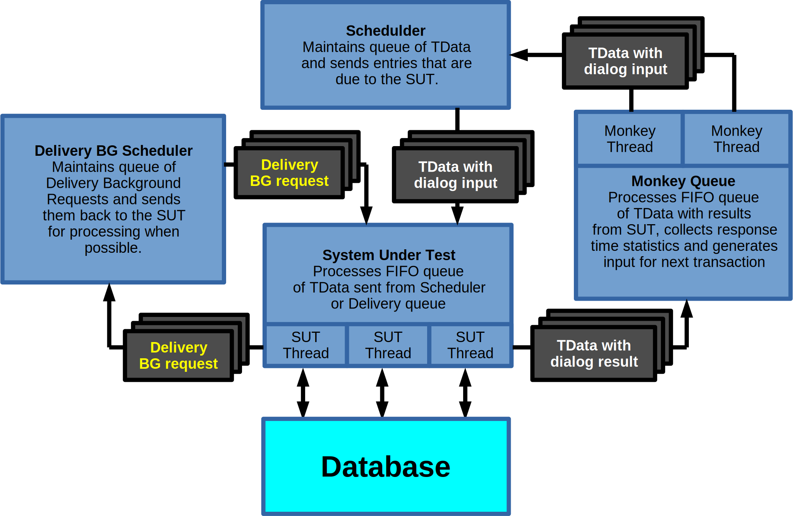

# BenchmarkSQL

BenchmarkSQL is a [GPLv2](docs/LICENSE.txt) fair-use TPC-C like testing
tool.

## Overview

BenchmarkSQL is implemented in Java, using JDBC to stress test SQL databases.
The overall architecture is a series of data structures, queues and thread
groups that handle the simulated terminals, users and application threads. 

Its architecture allows BenchmarkSQL to drive TPC-C configurations up to many
thousands of warehouses (known as the scaling factor) without overwhelming the
job scheduler of the test driver itself.
Yet it is capable of doing so without sacrificing one of the most important
measurements in a TPC-C, the end-user experienced response time at the terminal.

Please read the [Full Architecture Description](docs/TimedDriver.md)
for a detailed explanation of the above diagram.

## Building

BenchmarkSQL V6 is meant to be built into a [Docker](https://www.docker.com/)
container and controlled via its Flask based WEB UI and/or API. This allows
for easy deployment of the benchmark driver on servers and cloud systems
while controlling it through a browser or scripted.

See the [build instructions](docs/BUILDING.md) for details.

# Configuring and Running a Benchmark

BenchmarkSQL is configured with files in Java properties format.
A detailed description of all parameters in that file can be found
[here](docs/PROPERTIES.md).

[comment]: # (TODO: ##Automation. Point to a tutorial walking through using the (yet to be written) command line interface.) 

